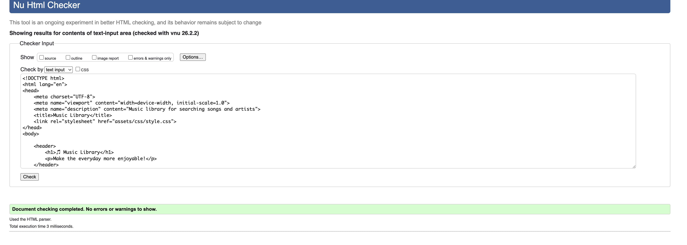
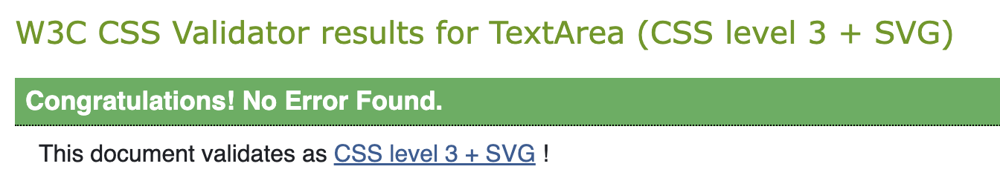
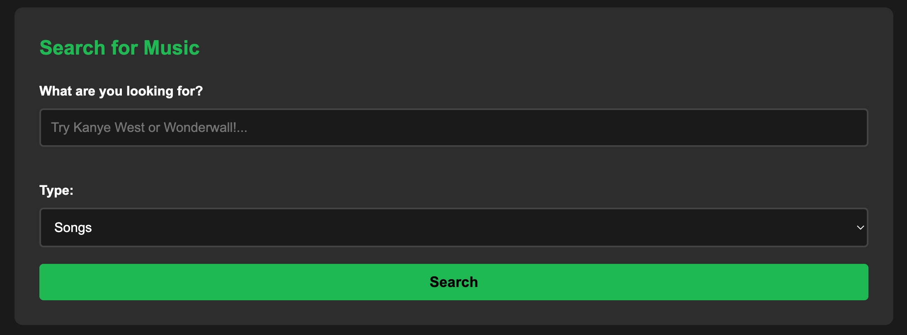
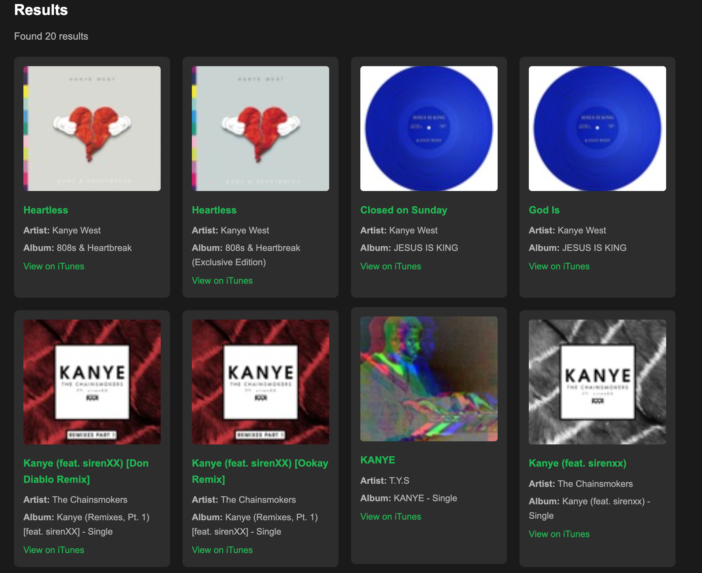
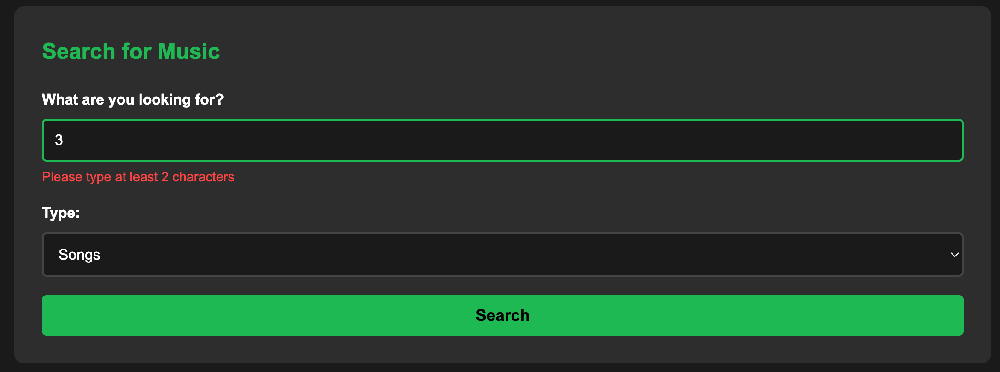

# Music Library

[Click here](https://.github.io/music-library/) to view the live web application.

## Project Development & Planning

### Project Goals

#### Project Purpose

"Music Library" aims to help users discover and explore music efficiently through an intuitive search interface powered by the iTunes Search API. The application provides instant access to millions of songs, artists and albums without requiring user registration or authentication.

#### User Goals

"Music Library" serves a wide range of users, especially:

1. **Music Enthusiasts**: People who want to quickly find information about songs and artists.
2. **Students**: Those learning about music or conducting research for projects.
3. **Casual Browsers**: Users who want to explore music without commitment or sign-up requirements.

### Research

#### Market Review

Before starting the development of "Music Library", I completed a search for free music search tools. I found that many required sign-up, had complex interfaces, or lacked immediate access to search functionality.

#### Key Takeaways

1. **Simplicity is Crucial**: The most successful products were those that prioritised user experience and immediate functionality.
2. **No Barriers to Entry**: Users prefer instant access without registration or authentication.
3. **Visual Presentation**: Album artwork and clear information display were essential for engagement.
4. **Responsive Feedback**: Real-time validation and loading indicators improve user confidence.

### User Stories

**User Story 1:** As a music enthusiast:

- Quickly search for my favourite songs and artists.
- See album artwork and detailed information.
- Access iTunes links to listen to music.
- Switch between searching for tracks, artists and albums.

**User Story 2:** As a student:

- Find specific songs or albums for research projects.
- Access reliable data from a trusted source (iTunes).
- Use the application on mobile devices for on-the-go research.

**User Story 3:** As a casual browser:

- Explore music without creating an account.
- Receive helpful error messages if something goes wrong.
- Navigate an intuitive interface that requires no learning curve.

### Design, Layout & Structure

In crafting "Music Library", I prioritised a design that speaks to its core functionality - searching and discovering music. The interface needed to be straightforward, visually appealing, and avoid unnecessary complexity. A dark colour palette was chosen, inspired by popular music streaming platforms, ensuring users find the application modern and familiar.

#### Wireframes

As the project was intended to be simple and focused, I created a basic wireframe. By laying out the design groundwork, it allowed for a clearer vision of the user's journey, ensuring an intuitive experience.

The wireframe emphasised:
- A prominent search form at the top
- A grid layout for results
- Clear visual hierarchy
- Mobile-first responsive design

#### Structure

The application follows a single-page structure with clearly defined sections:

1. **Header**: Contains the site title and tagline
2. **Search Section**: Features the search form with input and dropdown
3. **Results Section**: Displays search results in a responsive grid
4. **Footer**: Contains attribution and copyright information

#### Colour

A dark theme colour palette was chosen for "Music Library", inspired by modern music streaming platforms. This not only provides a sleek backdrop for album artwork but also reduces eye strain during extended use.

**Primary Colours:**
- Background: `#1a1a1a` - Deep black for the main background
- Secondary: `#2d2d2d` - Dark grey for cards and sections
- Accent: `#1db954` - Vibrant green for interactive elements
- Text: `#ffffff` - Pure white for maximum readability
- Error: `#ff4444` - Bright red for error messages

#### Fonts

For the typography, I focused on fonts that are readable and widely compatible. Arial (sans-serif) was chosen for its clarity and universal availability across all devices and browsers. This ensures that users can easily read all information, especially when viewing multiple search results.

### Technologies Used

In building "Music Library", I've utilised a combination of languages, APIs and tools to achieve a seamless user experience:

#### Languages

- **HTML5**: Used for structuring the content and semantic markup.
- **CSS3**: Applied for styling, ensuring the interface is user-friendly and responsive.
- **JavaScript (ES6+)**: Powers the dynamic features, providing real-time updates and API integration.

#### APIs

- **iTunes Search API**: A free, public API from Apple that provides access to millions of music tracks, artists and albums without requiring authentication or API keys.

#### Tools

- **Git & GitHub**: Used for version control and code storage.
- **VS Code**: My preferred code editor for development.
- **GitHub Pages**: Provides stable hosting for "Music Library".

## Testing

### Validator testing

[HTMl of index]

No errors were found with the W3C validator for index.html.

No errors were found with the W3C validator for CSS.

### Features

#### Whole Site

- **Consistent Header**: Fixed header with site branding visible on all scroll positions.
- **Responsive Design**: Fully responsive layout that adapts to all screen sizes from mobile to desktop.
- **Dark Theme**: Modern dark colour scheme that's easy on the eyes.
- **Footer Attribution**: Clear credit to the iTunes API and copyright information.

#### Main Features

- **Search Form**: 
  - Text input for search queries with placeholder text
  - Dropdown to select search type (Songs/Artists/Albums)
  - Real-time input validation
  - Submit button to trigger searches

- **Dynamic Results Grid**:
  - CSS Grid layout that adapts to screen size
  - Each result displays as a card with:
    - Album artwork (or placeholder if unavailable)
    - Title/name prominently displayed
    - Artist information
    - Additional metadata (album name, genre, track count, etc.)
    - Link to view on iTunes
  - Cards feature hover animations for better UX

- **Loading Indicator**:
  - Displays while fetching data from API
  - Provides clear feedback that search is in progress
  - Automatically hides when results load

- **Error Handling**:
  - Input validation shows errors for empty or invalid searches
  - Network errors display user-friendly messages
  - "No results" state provides helpful guidance
  - All errors displayed in clear, readable format

#### Future Features

To enhance "Music Library" further, I have identified several potential improvements:

- **Favourites System**:
  - Allow users to save favourite tracks using localStorage
  - Create a "Favourites" section to view saved items
  - Persist favourites across browser sessions

- **Audio Previews**:
  - Integrate 30-second preview playback if available from API
  - Add play/pause controls to result cards
  - Show progress indicator during playback

- **Advanced Filtering**:
  - Filter results by genre, release year or popularity
  - Sort results by different criteria (date, name, popularity)
  - Implement price range filtering for albums

- **Search History**:
  - Keep track of recent searches using localStorage
  - Quick access dropdown to repeat previous searches
  - Clear history option for privacy

- **Enhanced Accessibility**:
  - Keyboard shortcuts for common actions
  - Screen reader announcements for dynamic content
  - High contrast mode toggle

## Deployment

This site was deployed via GitHub pages using the following steps:
- From the GitHub repository, navigate to **Settings**
- In the left-hand navigation section select **Pages**
- From the source section drop-down menu change Branch from **none** to **main** and click the **Save**
- After a few minutes the website is live and will be automatically refreshed with each Git push command.

The link to the deployed site is:  

To run locally:
- Log into GitHub and click on repository to download 

- Select **Code** and click "Download the Zip file.
- Once download is completed, extract ZIP file and use in your local environment.

Alternatively you can **Clone** or **Fork** this repository into your GitHub account.

### Acknowledgments
* All the tutors ive made contact with for great guidance and feedback throughout the project.
* Code Institute Student Care Team: For extreme patience and general help as always!
* The wider Code Institute Slack Community: For helpful discussions and support.

